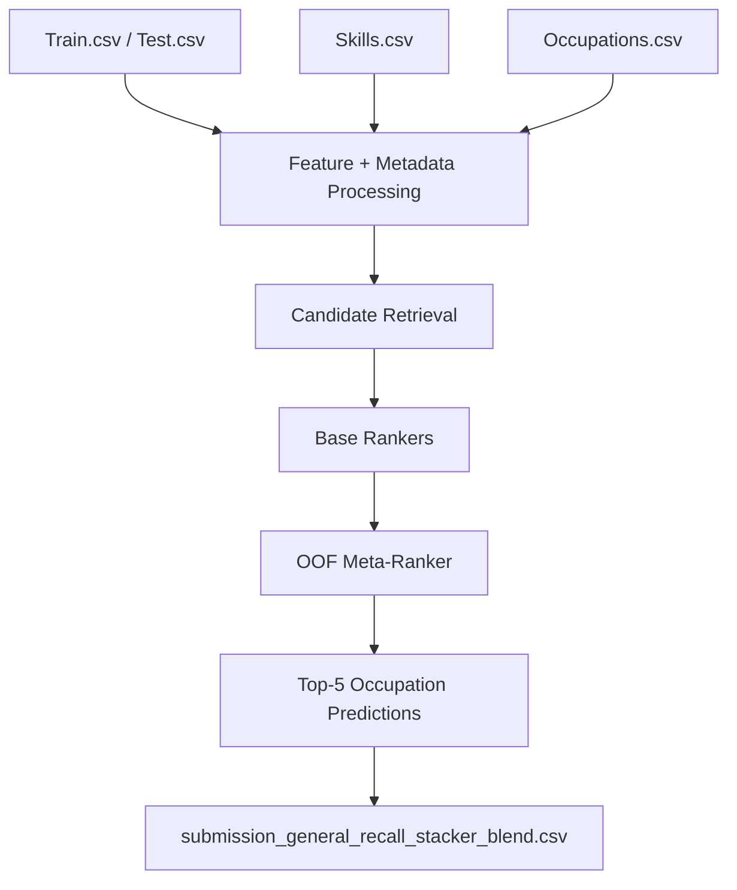

# Solution Documentation

Repository note:

- the challenge datasets are not committed in this GitHub repository
- download them from [Zindi challenge data page](https://zindi.africa/competitions/skills2job-intelligent-career-pathways-challenge/data)
- for the GitHub repo layout, place the CSV files inside `winning_solution/` before running the winning pipeline

## Challenge

AI4EAC Skills2Job Intelligent Career Pathways Challenge [INTERMEDIATE]

## Author / Team

Yen

## Overview and Objectives

This solution predicts the top 5 occupation codes from 5 input skills using a hybrid retrieve-and-rerank pipeline.

The core objective was to learn robust relationships between:

- skill combinations
- occupation codes
- occupation hierarchy
- occupation metadata

The solution was designed to generalize to the private leaderboard rather than optimize only for the public leaderboard. The final winning family used broad candidate retrieval, hierarchy-aware features, out-of-fold ranking, and a final out-of-fold stacker.

Expected outcome:

- each test row receives exactly 5 occupation codes
- the 5 occupations are ranked from highest confidence to lowest confidence
- the ranking is optimized for `mAP@5`

## Purpose and Scope

This documentation explains:

- what the solution does
- which files and packages are required
- how the data is processed
- how the models are trained
- how inference is performed
- how the final submission file is created
- what runtime and reproducibility behavior to expect

The scope is limited to the official challenge task:

- input: 5 skills per row
- output: 5 ranked occupation codes per row
- data: official challenge files only
- evaluation target: `mAP@5`

## Final Submitted Model

- Final selected submission file: `submission_general_recall_stacker_blend.csv`
- Leaderboard ID: `fDR4qiHL`
- Public score: `0.562135561`
- Private score: `0.560219036`

This submission was generated by:

- `make_oof_stacker.py`

and depends on:

- `make_map_ranker_stack.py`
- `make_hierarchical_ranker.py`

## Code Dependency and File Responsibilities

The winning solution is a three-file pipeline. The files should be reviewed and submitted together.

Dependency chain:

- `make_oof_stacker.py` -> `make_map_ranker_stack.py` -> `make_hierarchical_ranker.py`

Role of each file:

- `make_oof_stacker.py`
  - this is the winning entry-point script
  - it runs the final out-of-fold stacker pipeline
  - it imports core training, scoring, and submission-building functions from `make_map_ranker_stack.py`
  - it produces the final stacker submission files

- `make_map_ranker_stack.py`
  - this is the main retrieve-and-rerank engine
  - it loads the challenge data
  - it builds the retrieval artifacts and candidate tables
  - it trains the base ranking models
  - it prepares the ranking features that the stacker uses
  - it provides shared helper functions used by the stacker script

- `make_hierarchical_ranker.py`
  - this is the hierarchy and utility support file
  - it defines shared column groupings and helper utilities
  - it provides co-occurrence and query-frame helpers
  - it provides the occupation prefix models used in the recall pipeline

Why all three are required:

- `make_oof_stacker.py` cannot run by itself because it imports core functions from `make_map_ranker_stack.py`
- `make_map_ranker_stack.py` cannot run its full feature pipeline by itself because it imports hierarchy and prefix-model helpers from `make_hierarchical_ranker.py`
- the winning submission path therefore depends on all three files being present in the same working directory

Main outputs by file:

- `make_oof_stacker.py`
  - `submission_general_recall_stacker.csv`
  - `submission_general_recall_stacker_blend.csv`

- `make_map_ranker_stack.py`
  - base recall-family submissions such as the XGBoost bag, LightGBM, and blend outputs

- `make_hierarchical_ranker.py`
  - used as a support module rather than the final winning entry-point

What happens when the winning script is run:

1. `make_oof_stacker.py` imports shared constants and helper functions from `make_map_ranker_stack.py`.
2. `make_map_ranker_stack.py` imports hierarchy and prefix utilities from `make_hierarchical_ranker.py`.
3. The training and test data are loaded from the official challenge CSV files.
4. Retrieval artifacts and candidate occupation pools are built.
5. Base ranking models generate out-of-fold and test-time scores.
6. The stacker model is trained on OOF features.
7. Final blended scores are created and written to submission CSV files.

This means the reviewer should treat `make_oof_stacker.py` as the final runner, `make_map_ranker_stack.py` as the core engine, and `make_hierarchical_ranker.py` as the required support module for hierarchy-aware features.

## Usage Instructions

Required files in the working directory:

- `Train.csv`
- `Test.csv`
- `Skills.csv`
- `Occupations.csv`
- `SampleSubmission.csv`
- `make_oof_stacker.py`
- `make_map_ranker_stack.py`
- `make_hierarchical_ranker.py`

Recommended execution command:

```bash
python make_oof_stacker.py
```

Expected output files:

- `submission_general_recall_stacker.csv`
- `submission_general_recall_stacker_blend.csv`

If package installation is needed first, install the open-source dependencies listed in `requirements.txt` or the equivalent local environment.

Important execution note:

- run `make_oof_stacker.py` from the directory containing the challenge CSV files and the two supporting Python scripts
- do not move the supporting scripts to a different location unless import paths are also updated
- no notebook is required for the final winning pipeline

## Objective

For each test row, predict:

- `occ_1`
- `occ_2`
- `occ_3`
- `occ_4`
- `occ_5`

ordered from most confident to least confident.

Evaluation metric:

- `mAP@5`

## Data Used

Only the challenge-provided files were used:

- `Train.csv`
- `Test.csv`
- `Skills.csv`
- `Occupations.csv`
- `SampleSubmission.csv`

No external datasets were used.

## Tools and Packages

All tools used are open-source.

Main libraries:

- `pandas`
- `numpy`
- `scipy`
- `scikit-learn`
- `xgboost`
- `lightgbm`
- `implicit`
- `torch`
- `threadpoolctl`

No AutoML was used.

## Design Decisions

The main design choices were intentionally conservative and generalization-focused:

- use broad candidate retrieval first, because the ranking model cannot recover occupations that never enter the candidate pool
- use hierarchy-aware features, because occupation codes contain useful prefix structure
- use out-of-fold predictions, because they reduce leakage and create stronger meta-features
- use multiple retrieval views, because different views capture different types of skill-to-job relationships
- use a simple final blend over strong rankers, because this was more stable than relying on one complex model only

Important practical decisions:

- no external datasets were added
- no manual thresholds or rounded probabilities were used
- no paid APIs or private services were used
- model changes were accepted only when offline validation improved in a clean way

## High-Level Architecture



## ETL Process

### Extract

The pipeline loads the challenge CSV files from the project root.

Source files and roles:

- `Train.csv`: supervised training labels
- `Test.csv`: unseen rows for final inference
- `Skills.csv`: skill metadata used for query enrichment
- `Occupations.csv`: occupation metadata and hierarchy cues
- `SampleSubmission.csv`: submission format reference

### Transform

The transformation stage includes:

- converting IDs and occupation codes to string format
- creating skill token documents from the 5 query skills
- building metadata documents from skill category, type, and subcategory information
- creating occupation metadata text fields
- building occupation prefix information from the occupation codes
- building co-occurrence tables between skills and occupations
- building skill-pair to occupation relationships

### Load

The transformed features are held in memory and used directly for:

- retrieval
- ranking
- out-of-fold training
- inference on the test set

There is no external database or feature store. This is a local batch pipeline, not an online deployment.

## Data Modeling

### Retrieval Layer

The candidate generation stage creates a broad occupation pool for each query using multiple retrieval views:

- TF-IDF nearest-neighbor retrieval over skill IDs
- TF-IDF nearest-neighbor retrieval over metadata text
- set-based query similarity retrieval
- signature-based retrieval from category, type, and subcategory summaries
- BM25 skill-to-occupation retrieval
- implicit ALS skill-to-occupation retrieval
- co-occurrence retrieval
- skill-graph retrieval
- broader skill-walk expansion
- occupation profile retrieval
- group profile retrieval
- career profile retrieval
- semantic occupation-text retrieval
- prefix-based expansion
- occupation-group expansion
- career-area expansion

The aim of this stage is not to predict the final ranking directly, but to ensure that the correct occupations enter the candidate set.

Why this matters:

- the challenge is evaluated on top-5 ranking
- if the correct occupations are missing from the retrieved candidate pool, the final ranker cannot recover them
- retrieval quality sets an upper bound on final performance

### Prefix Modeling

The pipeline also predicts hierarchical occupation prefixes:

- 2-digit prefix model
- 4-digit prefix model

These models are trained using:

- `SGDClassifier`
- `OneVsRestClassifier`

The prefix predictions are used as retrieval and ranking features.

### Base Ranking Models

The base ranking layer uses:

- bagged `XGBoostRanker` with `objective="rank:map"`
- `LightGBMRanker` with `lambdarank`

The XGBoost ranker is the main base model. The LightGBM ranker adds diversity.

### Final Meta-Ranker

The final winning solution uses an out-of-fold stacker built from:

- OOF predictions from the XGBoost bag
- OOF predictions from LightGBM
- retrieval support features
- rank features
- agreement and disagreement features
- rarity and hierarchy features

The stacker itself is another:

- `XGBoostRanker`

The final submission is produced from a blend of:

- stacker normalized score
- XGBoost normalized score
- LightGBM normalized score

## Feature Engineering

Important feature groups include:

- raw retrieval scores
- retrieval ranks
- retrieval support counts
- co-occurrence hits
- prefix model scores
- occupation frequency features
- occupation share within prefix
- rare and ultra-rare flags
- query category diversity
- query subcategory diversity
- query type diversity
- software-skill count
- occupation-group and career-area retrieval scores
- profile similarity scores
- model agreement and disagreement features in the stacker

Feature representation notes:

- sparse text and token features are created from skill IDs and metadata strings
- hierarchy and frequency features are numeric and are used directly by the ranking models
- no external annotation or external embedding dataset was used

## Training and Validation Procedure

The solution was developed with offline validation first and leaderboard second.

Training procedure:

1. Build retrieval artifacts from the official training data.
2. Generate candidate occupations for each training row.
3. Train grouped ranking models on those candidate sets.
4. Create OOF predictions for the training rows.
5. Train the final stacker on OOF features.
6. Rebuild candidate tables for the test rows.
7. Score and rank test candidates.
8. Export the top 5 occupations per row.

Validation procedure:

- exact candidate ceiling audits to measure retrieval quality
- holdout checks to compare model families
- OOF predictions for stacker features
- rejection of ideas that improved public score only without clean offline support

Guiding principle:

- new ideas were kept only if they improved offline validation in a clear and reproducible way

## Inference

For each test row:

1. Build query features from the 5 skills.
2. Generate a candidate occupation pool using the retrieval layer.
3. Score the candidates with the base rankers.
4. Score the candidates with the OOF stacker.
5. Sort the candidates by the final blended score.
6. Output the top 5 occupation codes.

Inference environment:

- local batch script execution
- no external API calls
- no paid services
- output written directly to CSV in the required submission format

No thresholding was used.

No probability rounding was used to manipulate leaderboard position.

## Runtime

Approximate end-to-end runtime for the winning pipeline:

- about `16 minutes`

This includes:

- data loading
- preprocessing
- retrieval building
- OOF base-ranker generation
- stacker training
- inference
- submission file writing

Approximate runtime by major script on the local machine:

- `make_oof_stacker.py`: about `13-16 minutes` end-to-end
- `make_map_ranker_stack.py`: about `8-10 minutes` for the recall-expanded base pipeline
- `make_hierarchical_ranker.py`: shorter than the full stacker pipeline and used mainly as a supporting model family during experimentation

Approximate runtime by model stage inside the winning path:

- retrieval and candidate building: several minutes
- base rankers: several minutes
- OOF stacker training and final scoring: a few minutes

Runtime varies with:

- CPU speed
- GPU availability
- package versions
- whether model downloads or caches are already warm

## Hardware

GPU used:

- `NVIDIA GeForce RTX 2050`

The machine also had:

- `Intel(R) Arc(TM) Graphics`

## Seeds and Reproducibility

Seeds were set in the pipeline for:

- `numpy`
- `torch`
- `KFold`
- `train_test_split`
- `XGBoost`
- `LightGBM`
- `ALS`

Main seed value:

- `42`

Important reproducibility note:

The pipeline is seeded, but the exact submission file is not perfectly bitwise deterministic in the current environment. Reruns can produce slightly different outputs because of:

- GPU-related nondeterminism
- ranking tie behavior in top-k candidate selection

However, reruns remain in the same strong model family and produce similar high-quality submissions.

Practical reproducibility guidance:

- use the same official challenge CSV files
- use the same Python package versions where possible
- keep the same script set together
- prefer the same hardware class when possible
- include the exact submitted CSV artifact together with the code

For code review, the exact submitted artifact should be included together with the generating code.

## Performance Metrics

Primary challenge metric:

- `mAP@5`

Final winning submission:

- Public: `0.562135561`
- Private: `0.560219036`

Other strong submissions from the same family:

- `submission_general_recall_blend.csv` -> Public `0.562516248`
- `submission_general_recall_xgb_bag.csv` -> Public `0.561429897`
- `submission_general_recall_stacker.csv` -> Public `0.560362116`

Offline metrics used during development:

- holdout `mAP@5`
- OOF candidate ceiling checks
- recall-oriented candidate audits

## Error Handling and Logging

The scripts print progress information during:

- fold generation
- retrieval construction
- model training
- submission writing

This solution does not use a formal logging framework, but progress messages are included to make debugging easier.

Potential failure points:

- missing challenge CSV files
- missing open-source package dependencies
- hardware differences affecting runtime or exact output

Recommended checks before rerunning:

- verify that all required CSV files are present
- verify that package imports succeed
- verify that the output CSV contains real occupation codes, not encoded label IDs
- verify that each row contains exactly 5 ranked occupations

## Maintenance and Monitoring

To maintain this solution:

- keep the challenge CSV files in the project root
- install the required open-source packages
- rerun the pipeline from the main script
- compare produced submissions against saved artifacts when needed

If moving to a different machine:

- document package versions
- document hardware
- expect small output differences if GPU execution changes

Suggested lifecycle and update strategy:

- keep the winning scripts and the winning CSV artifact archived together
- version any future edits instead of overwriting the final competition pipeline
- rerun validation before accepting any change to retrieval, ranking, or blending logic
- keep a small benchmark table of public score, private score, and offline validation for each major model family

Scaling notes:

- the current solution is file-based and memory-based, which is appropriate for this challenge size
- for larger datasets, retrieval artifacts and candidate tables could be cached explicitly to reduce recomputation
- formal logging can be added later if the solution is moved into production

## Main Files

Winning entry-point:

- `make_oof_stacker.py`

Supporting files:

- `make_map_ranker_stack.py`
- `make_hierarchical_ranker.py`

Winning artifact:

- `submission_general_recall_stacker_blend.csv`

Verification rerun artifact:

- `submission_general_recall_stacker_blend.rerun_verify.csv`

Additional supporting artifact:

- `submission_general_recall_stacker.csv`

## How to Run

Run the winning pipeline with:

```bash
python make_oof_stacker.py
```

Expected outputs:

- `submission_general_recall_stacker.csv`
- `submission_general_recall_stacker_blend.csv`

Best practice for code review submission:

1. include the exact winning CSV artifact
2. include this documentation file
3. include the three Python scripts used by the winning pipeline
4. include the dependency list
5. note that seeded reruns may still differ slightly because of hardware and ranking nondeterminism

## Compliance Notes

This solution complies with the challenge rules as follows:

- uses only open-source tools
- uses only provided challenge datasets
- uses no AutoML
- uses no external private services
- uses no external datasets
- outputs ranked labels, not thresholded probabilities

## Known Limitations

- the seeded pipeline is not perfectly bitwise deterministic across reruns in the current environment
- runtime can increase on machines without comparable hardware
- the solution was designed for the challenge CSV format and is not packaged as a general-purpose service

## Summary

This solution is a hybrid retrieve-and-rerank system designed to maximize generalization on `mAP@5` using only the official challenge data and open-source tools. The winning submission family relied on broad candidate recall, hierarchy-aware features, strong ranking models, and an OOF stacker. The documentation, code, and final artifact should be submitted together so that the review team can both understand the pipeline and rerun a close reproduction of the final result.
